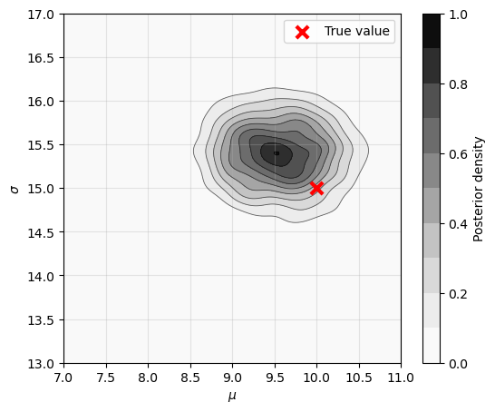

# SimulatedAnnealingABC

Approximate Bayesian Computation (ABC) is a family of simulation-based inference methods, also known as likelihood-free inference. This repository contains simulated-annealing-based ABC algorithms, collectively referred to as SABC methods.

The package includes:

- proposal mechanisms (built-in),
- the SABC algorithm itself,

and requires (user-defined):

- summary statistics
- a metric (distance),
- and a stochastic simulator.

All user-facing functions (simulator, summary statistics, prior, distance) use a **batch API** operating on 2-D arrays, enabling vectorized NumPy computation across entire particle populations.

The SABC algorithm supports both **single-ε** and **multi-ε** annealing schemes and is suitable for computationally expensive stochastic models.

---

## Features

- **Batch-vectorized inner loop**
  - All particle updates are processed in batch via NumPy (no Python per-particle loop)
  - Allocation-free distance evaluation with lazy 2-D buffers
  - In-place array operations throughout
- **Thread-based parallelism**
  - Multi-threaded simulator execution via `n_workers` in `make_f_dist`
  - Concurrent half-batch population updates via `parallel_batches` in `SABCConfig`
  - Both layers are composable and opt-in (serial by default)
- **Optional Numba acceleration**
  - User-supplied single-particle `@njit` functions are automatically wrapped in a `prange` batch kernel
- **Reproducibility by design**
  - Independent RNG control for:
    - simulator / distance function
    - SABC algorithm (accept-reject, resampling)
    - proposal mechanisms
- **Modular architecture**
  - Plug in any simulator and summary statistics
  - Custom distance metrics (absolute, squared, weighted, ...)
- **Multiple proposal mechanisms**
  - Differential Evolution
  - Random Walk
  - Stretch Move
- **Restartable runs**
  - Population updates can be continued from previous results

---

## Installation

Clone the repository:

```bash
git clone https://github.com/ulzegasi/SimulatedAnnealingABC.git
cd SimulatedAnnealingABC
```

Create the Conda environment from the provided file:

```bash
conda env create -f environment.yml
conda activate sabc_env
```

**Note**
The code currently targets Python ≥ 3.14.

---

## Development & Testing

Setting up the devcontainer will install `environment.sabc-dev.yml`.
So this environment should be used.

### Running Tests

```bash
# Fast unit tests (seconds)
pytest

# Integration tests (minutes)
pytest -m slow

# Integration tests with visualization
VISUALIZE=1 pytest -m slow
```

### Jupyter Notebooks

Example notebooks are maintained as `.py` files in `examples/` using jupytext's `percent` format.
To generate `.ipynb` notebooks:

```bash
jupytext --to ipynb examples/test_*.py
```

The `.py` files are the source of truth—edit those directly.

---

## Basic Usage

We consider a simple toy problem where the observed data (y_obs) are generated from a normal distribution with unknown mean and standard deviation.
Inference is performed on the parameters `(mu, sigma)` using the empirical mean and standard deviation as summary statistics.

```python
import numpy as np
import matplotlib.pyplot as plt
from scipy.stats import gaussian_kde
from simulated_annealing_abc import (
    SABCConfig,
    sabc,
    make_f_dist,
    update_population,
    DifferentialEvolution,
    StretchMove,
    RandomWalk,
    save_sabc_result,
    load_sabc_result,
)
```

### 0. Generate data

```python
true_mu = 10.0
true_sigma = 15.0
np.random.seed(1822)
y_obs = np.random.normal(true_mu, true_sigma, size=1000)
```

### 1. Define a prior

The prior must provide **batch** methods:

- `rvs(rng, size=n_particles)` — draw `n_particles` samples, returning shape `(n_particles, n_para)`
- `logpdf(theta_batch)` — evaluate the log-density for a `(n_particles, n_para)` batch, returning `(n_particles,)`

```python
class Prior:
    def __init__(self, mu_min, mu_max, sigma_min, sigma_max):
        self.mu_min = mu_min
        self.mu_max = mu_max
        self.sigma_min = sigma_min
        self.sigma_max = sigma_max

    def rvs(self, rng: np.random.Generator, size: int = 1) -> np.ndarray:
        mu = rng.uniform(self.mu_min, self.mu_max, size=size)
        sigma = rng.uniform(self.sigma_min, self.sigma_max, size=size)
        return np.column_stack([mu, sigma])            # (size, 2)

    def logpdf(self, theta: np.ndarray) -> np.ndarray:
        theta = np.atleast_2d(theta)                   # ensure (n_particles, 2)
        mu = theta[:, 0]
        sigma = theta[:, 1]
        in_bounds = (
            (self.mu_min <= mu) & (mu <= self.mu_max)
            & (self.sigma_min <= sigma) & (sigma <= self.sigma_max)
        )
        lp = np.full(theta.shape[0], -np.inf)
        lp[in_bounds] = (
            -np.log(self.mu_max - self.mu_min) - np.log(self.sigma_max - self.sigma_min)
        )
        return lp                                       # (n_particles,)

prior = Prior(mu_min=-10.0, mu_max=20.0, sigma_min=0.0, sigma_max=25.0)
```

### 2. Define simulator and summary statistics

Both functions operate on **2-D batches** and fill output arrays **in-place**:

- `simulator(theta, y, rng)` — `theta` is `(n_batch_particles, n_para)`, `y` is `(n_batch_particles, n_samples)`
- `stats_fn(y, ss_out)` — `y` is `(n_batch_particles, n_samples)`, `ss_out` is `(n_batch_particles, n_stats)`

```python
def simulator(theta: np.ndarray, y: np.ndarray, rng: np.random.Generator) -> None:
    mu = theta[:, 0:1]      # (n_batch_particles, 1)
    sigma = theta[:, 1:2]   # (n_batch_particles, 1)
    y[:] = rng.normal(loc=mu, scale=sigma, size=y.shape)  # in-place

def stats_fn(y: np.ndarray, ss_out: np.ndarray) -> None:
    ss_out[:, 0] = np.mean(y, axis=1)
    ss_out[:, 1] = np.std(y, axis=1, ddof=0)
```

Compute observed summary statistics (`ss_obs`). Since `stats_fn` expects a
2-D batch, reshape the 1-D observed data to `(1, n_samples)`:

```python
n_stats = 2
ss_obs = np.empty((1, n_stats), dtype=np.float64)
stats_fn(y_obs.reshape(1, -1), ss_obs)
ss_obs = ss_obs.ravel()  # -> (n_stats,)
```

### 3. Build the distance function

```python
f_dist = make_f_dist(
    n_samples=1000,
    ss_obs=ss_obs,
    simulator=simulator,
    stats_fn=stats_fn,
    seed=123,          # simulator-level randomness
    distance="abs",    # distance per statistic: abs(ss_sim-ss_obs)
    n_workers=1,       # number of threads for simulator (default: 1)
)
```

Available distances: "abs", "sq", "weighted_sq". Default: "abs".

Set `n_workers` > 1 to run the simulator in parallel using a `ThreadPoolExecutor`.
This is effective when the simulator releases the GIL (e.g. NumPy array operations,
RNG calls). Each worker gets its own RNG stream and scratch buffers. See
[Parallelization](#parallelization) for details.

### 4. Configure and run SABC

All algorithm settings are collected in a single `SABCConfig` dataclass.
The simulation budget (`n_simulation`) is the only argument passed separately,
since it typically changes between the initial run and subsequent updates.

```python
rng_alg  = np.random.default_rng(18)
rng_prop = np.random.default_rng(22)

config = SABCConfig(
    f_dist=f_dist,
    prior=prior,
    n_particles=1000,
    v=1.0,
    show_checkpoint=500,
    algorithm="single_eps",   # or "multi_eps"
    proposal=DifferentialEvolution(n_para=2, rng=rng_prop),
    rng=rng_alg,
)

result = sabc(config, n_simulation=1_000_000)
```

#### SABCConfig fields

| Field | Default | Description |
|---|---|---|
| `f_dist` | *(required)* | Distance function (from `make_f_dist` or hand-written) |
| `prior` | *(required)* | Prior with `.rvs(rng, size=n_particles)` -> `(n_particles, n_para)` and `.logpdf(batch)` -> `(n_particles,)` |
| `n_particles` | 1000 | Population size |
| `v` | 1.0 | Annealing speed |
| `delta` | 0.1 | Resampling parameter |
| `algorithm` | `"single_eps"` | `"single_eps"` or `"multi_eps"` |
| `resample` | `None` | Resampling interval (defaults to `2 * n_particles`) |
| `proposal` | `None` | Proposal mechanism (defaults to `DifferentialEvolution`) |
| `parallel_batches` | `False` | Run the two half-batch updates concurrently using threads. See [Parallelization](#parallelization). |
| `rng` | `None` | Algorithm RNG (`np.random.Generator`) |
| `seed` | `None` | Alternative to `rng` (creates one internally) |
| `checkpoint_history` | 1 | Record histories every N updates |
| `show_progressbar` | `None` | Show progress bar if available |
| `show_checkpoint` | `None` | Log progress every N updates |

### 5. Use update_population to continue from previous result

```python
result_2 = update_population(result, n_simulation=1_000_000)
```

### 6. Get/Plot results

Extract posterior sample (population) and trajectories for temperature (epsilon), distances (rho) and modified distances (u).

```python
# Population — stored as (n_particles, n_para); transpose for per-parameter slicing
pop = result_2.population.T     # (n_para, n_particles)
mu_post = pop[0, :]
sigma_post = pop[1, :]
# Epsilon trajectory
eps = np.column_stack(result_2.state.epsilon_history)
# Mean rho trajectory
rho = np.column_stack(result_2.state.rho_history)
# Mean u trajectory
u = np.column_stack(result_2.state.u_history)
```

Plot posterior sample.

```python
values = np.vstack([mu_post, sigma_post])
kde = gaussian_kde(values)
# --- Grid (manual zoom region) ---
mu_lims = (7, 11)
sigma_lims = (13, 17)
mu_grid = np.linspace(mu_lims[0], mu_lims[1], 250)
sig_grid = np.linspace(sigma_lims[0], sigma_lims[1], 250)
MU, SIG = np.meshgrid(mu_grid, sig_grid)
# --- Evaluate density ---
positions = np.vstack([MU.ravel(), SIG.ravel()])
Z = kde(positions).reshape(MU.shape)
# --- Plot ---
plt.figure(figsize=(6, 5))
plt.grid(True, alpha=0.3, zorder=0)
# --- Shaded contours (grayscale) ---
n_levels = 10
cf = plt.contourf(MU, SIG, Z, levels=n_levels, cmap="Greys", zorder=1)
# --- Contour lines ---
plt.contour(MU, SIG, Z, levels=n_levels, colors="black", linewidths=0.6, alpha=0.6, zorder=2)
# --- True parameters ---
plt.scatter(
    true_mu,
    true_sigma,
    c="red",
    s=90,
    linewidths=3.0,
    marker="x",
    zorder=3,
    label="True value"
)

plt.xlim(mu_lims)
plt.ylim(sigma_lims)
plt.xlabel(r"$\mu$")
plt.ylabel(r"$\sigma$")
plt.colorbar(cf, label="Posterior density")
plt.legend()
plt.show()
```



### 7. Save results

The function **save_sabc_result()** saves the full SABC result to disk using Python’s **pickle** serialization.

```python
save_sabc_result(result_2, [...some path...] / "result_2.pkl")
```

Saved results can be loaded using **load_sabc_result()**

```python
loaded_result = load_sabc_result([...some path...] / "result_2.pkl")
```

---

## Reproducibility

The algorithm has **three independent sources of randomness**:

1. **Simulator / distance function**
   - Randomness from the stochastic forward model used inside `f_dist`
   - Controlled via the `seed` argument in `make_f_dist`

2. **SABC algorithm**
   - Accept/reject decisions and population resampling
   - Controlled via `rng` or `seed` in `SABCConfig`

3. **Proposal mechanism**
   - Randomness used to generate parameter proposals
   - Each proposal object accepts its own `rng`

For **fully reproducible runs**, all three sources must be fixed explicitly.

---

## Parallelization

The library provides two composable parallelization layers, both using
`ThreadPoolExecutor` and both opt-in (serial by default, zero overhead when
unused).

### Layer 1: Multi-threaded simulator (`n_workers`)

Pass `n_workers` > 1 to `make_f_dist` to split each batch of particles across
multiple threads for the simulator + summary-statistics step:

```python
f_dist = make_f_dist(
    n_samples=1000,
    ss_obs=ss_obs,
    simulator=simulator,
    stats_fn=stats_fn,
    seed=123,
    n_workers=4,       # split each batch across 4 threads
)
```

Each worker gets its own RNG stream (spawned from the parent seed via
`SeedSequence`) and its own scratch buffers (`y_buf`, `ss_buf`), so there
are no data races. This is effective when the simulator spends most of its
time in GIL-releasing operations (NumPy array ops, RNG calls) -- which is
the typical case.

`n_workers` controls parallelism in both modes: in NumPy mode it sets the
`ThreadPoolExecutor` thread count; in Numba mode (`use_numba=True`) it
controls `nb.set_num_threads()` for Numba's `prange` thread pool.

### Layer 2: Concurrent half-batch updates (`parallel_batches`)

Set `parallel_batches=True` in `SABCConfig` to run the two half-population
updates concurrently. This is an emcee-style relaxation: both halves see a
stale snapshot of the other half (instead of batch 2 seeing batch 1's freshly
updated state).

```python
config = SABCConfig(
    f_dist=f_dist,
    prior=prior,
    n_particles=1000,
    proposal=DifferentialEvolution(n_para=2, rng=rng_prop),
    parallel_batches=True,   # concurrent half-batch updates
    rng=rng_alg,
)
```

When enabled, the library internally:

- Clones the proposal into 2 instances with independent RNG streams
- Clones `f_dist` into 2 instances with independent seeds and buffers
- Allocates 2 sets of scratch buffers for accept/reject
- Submits both half-batch updates to a `ThreadPoolExecutor(max_workers=2)`

This changes MCMC dynamics (both halves see stale snapshots instead of
the serial dependency), which is why it is opt-in. Statistically, this is
the same relaxation used by the emcee ensemble sampler and is valid for
the SABC algorithm.

### Combining both layers

Both layers compose naturally. Use `n_workers` for intra-batch parallelism
(splitting each half-batch across threads) and `parallel_batches` for
inter-batch parallelism (running both halves concurrently):

```python
f_dist = make_f_dist(
    n_samples=1000,
    ss_obs=ss_obs,
    simulator=simulator,
    stats_fn=stats_fn,
    seed=123,
    n_workers=4,
)

config = SABCConfig(
    f_dist=f_dist,
    prior=prior,
    n_particles=1000,
    proposal=DifferentialEvolution(n_para=2, rng=rng_prop),
    parallel_batches=True,
    rng=rng_alg,
)

result = sabc(config, n_simulation=1_000_000)
```

In this configuration, each population update launches 2 half-batch tasks,
each of which internally splits its simulator calls across 4 threads --
up to 8 threads of useful work per update.

### When to use each layer

| Layer | Best for | Overhead |
|-------|----------|----------|
| `n_workers` | Expensive simulators with large `n_samples` | Thread pool + per-worker buffers |
| `parallel_batches` | Large populations where each half-batch is substantial | Clone proposal + f_dist + 2-thread pool |
| Both | Large populations with expensive simulators | Combined |

For small toy problems, serial mode (the default) is typically fastest due
to zero overhead.

### Caveats

**Thread-safety requirements.** Both parallelization layers use threads, not
processes. Any user-supplied function that runs concurrently must be
thread-safe:

- **`prior.logpdf()`** is called from `_update_batch`, which runs in worker
  threads when `parallel_batches=True`. The function must be stateless (no
  mutation of shared data). Most priors (scipy distributions, pure-NumPy
  implementations) satisfy this. A prior that mutates internal state (e.g.
  caching intermediate results) will cause data races.
- **`simulator`** and **`stats_fn`** are called from worker threads when
  `n_workers` > 1. Each worker receives its own pre-allocated buffers and
  its own RNG, so standard implementations that only write to the provided
  output arrays are safe. A simulator that writes to global or shared state
  will cause data races.

**Core oversubscription.** Both layers create `ThreadPoolExecutor` pools.
When combined (`n_workers=W` + `parallel_batches=True`), the total thread
count is up to `2 * W`. If `W` already matches the number of physical cores,
enabling `parallel_batches` on top will oversubscribe the CPU and may hurt
rather than help. Additionally, NumPy itself may use multi-threaded BLAS
(controlled by `OMP_NUM_THREADS`, `MKL_NUM_THREADS`, etc.), which compounds
the problem. As a rule of thumb:

- Set `n_workers` to at most the number of physical cores.
- If using `parallel_batches=True` alongside `n_workers`, reduce `n_workers`
  to leave room for the second half-batch thread (e.g. `n_workers = cores // 2`).
- If the simulator is already parallelized internally (e.g. via BLAS or
  Numba `prange`), set `n_workers=1` and consider `parallel_batches` only.

---

## Optional Numba Acceleration

`SimulatedAnnealingABC` supports an **optional Numba-accelerated path** for the simulator and summary-statistics computation inside the distance function `f_dist`.

### Why Numba?

The dominant cost in SABC is typically the **simulator + summary statistics**.

If these components can be expressed in a Numba-compatible form (no Python objects, no dynamic allocations), they can be compiled with `numba.njit` and executed inside a parallel `prange` loop over particles.

The standard NumPy batch implementation remains the **default** and is often already very efficient.

Numba acceleration is therefore **optional** and intended for advanced use cases where the per-particle simulator is expensive or difficult to vectorize with NumPy.

---

### Standard (NumPy) mode — default

```python
f_dist = make_f_dist(
    n_samples=n_samples,
    ss_obs=ss_obs,
    simulator=simulator,      # batch Python / NumPy: (n_batch_particles, n_para), (n_batch_particles, n_samples)
    stats_fn=stats_fn,        # batch Python / NumPy: (n_batch_particles, n_samples), (n_batch_particles, n_stats)
)
```

This version:

- Uses vectorized NumPy throughout
- Is fully reproducible
- Requires no optional dependencies

### Numba-accelerated mode (advanced)

To enable the Numba path, provide **single-particle** Numba-compiled versions of the simulator and summary-statistics functions and pass `use_numba=True` to `make_f_dist`. The library automatically wraps them in a `numba.prange` batch kernel, so they are executed in parallel across particles:

```python
@nb.njit(cache=True)
def simulator_nb(theta, y):
    """Single-particle: theta is 1-D (n_para,), y is 1-D (n_samples,). Fills y in-place."""
    mu = theta[0]
    sigma = theta[1]
    tmp = np.random.normal(0.0, 1.0, y.size)
    for i in range(y.size):
        y[i] = mu + sigma * tmp[i]

@nb.njit(cache=True)
def stats_fn_nb(y, ss):
    """Single-particle: y is 1-D (n_samples,), ss is 1-D (n_stats,). Fills ss in-place."""
    s = 0.0
    for i in range(y.size):
        s += y[i]
    m = s / y.size
    v = 0.0
    for i in range(y.size):
        d = y[i] - m
        v += d * d
    ss[0] = m
    ss[1] = np.sqrt(v / y.size)

f_dist_fast = make_f_dist(
    n_samples=n_samples,
    ss_obs=ss_obs,
    use_numba=True,
    n_workers=4,                 # controls nb.set_num_threads()
    simulator=simulator_nb,      # @numba.njit, single-particle
    stats_fn=stats_fn_nb,        # @numba.njit, single-particle
)
```

**Requirements for Numba mode:**

- `simulator(theta, y)` — single-particle: `theta` is 1-D `(n_para,)`, `y` is 1-D `(n_samples,)`. Fills `y` in-place.
- `stats_fn(y, ss)` — single-particle: `y` is 1-D `(n_samples,)`, `ss` is 1-D `(n_stats,)`. Fills `ss` in-place.
- Both functions must be compiled with `@numba.njit`
- The library internally wraps them in a `numba.prange` loop, so the user writes only the per-particle logic
- Avoid per-call allocations inside the Numba functions for best performance

If Numba is not installed, attempting to pass `use_numba=True` raises an informative error.
